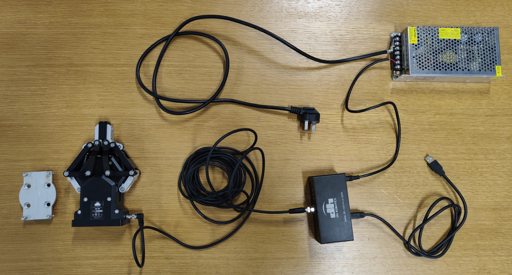

## 两指夹具

### 硬件详情

我们实验室的这款二指夹爪是大寰机器人的[AG95](https://www.dh-robotics.com/product/ag)，支持ROS控制，可以更换到UR5机器臂上使用。

要使用夹爪，我们需要而外配备一个低压电源，使用的24V、5A的电源就可以了，下图是夹爪的完整配置



上方银色的金属盒子是我们自己购买的电源，将它的三插头插到插座进行供电，夹具主体连接着黑色中控盒子，它有条电源线，用于连接银色电源，末端是裸露的红黑细线，注意红色是正极，黑色的负极。另一条线是USB，用于连接电脑进行控制。

夹具除了本体外，为了能安装到机器臂，他们还附带了一个连接板。

黑色中控盒子上面有指示灯和开关，当电源接通后，我们还需要将黑盒子上面的开关打开，将“1”按下去才是开启，“0”按下去是关闭电源。


### 控制夹具

首先电源线通电，打开黑色盒子上的开关，USB口连接我们的电脑（Ubuntu上用ROS控制）。指示灯会亮起。

接着去github上获取吸盘的控制代码：https://github.com/Robotics-Innovations-Lab/AG95-ROS

新建一个ROS工作区，将其克隆下来，编译这个项目。

编译好之后，我们准备执行 `dh_gripper_driver` 里面的文件，启动夹具：

    roslaunch dh_gripper_driver dh_gripper.launch

也可以用下面的代码加入自己定义的launch文件（我们机器人启动文件已经加上了）：
```xml
<include file="$(find dh_gripper_driver)/launch/dh_gripper.launch"/>
```

接下来可以用代码控制了，这里实现了一个抓取类 [`dh_gripper.py`](./dh_gripper.py) ，可以用来测试闭合。要注意一点，当初这个机器手故障我们寄回去修了，修复后的力度可能是原版的60%：


```python
rospy.init_node('dh_test', anonymous=True)
gripper = DH_Gripper()
gripper.open()
gripper.close()
```
