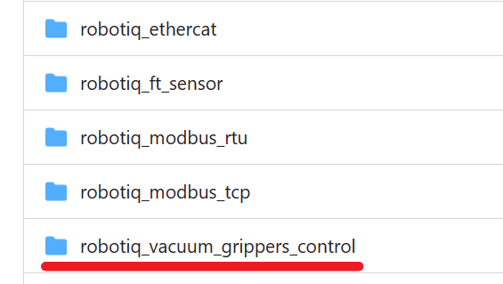

## 真空吸盘手

### 硬件详情

我们实验室的这款吸盘是Robotiq的[epick](https://robotiq.com/products/vacuum-grippers)，采购方是东莞的库埼公司。支持ROS控制，可以更换到UR5机器臂上使用。

要使用吸盘，我们需要而外配备一个低压电源，使用的24V、5A的电源就可以了，下图是吸盘的完整配置


上方银色的金属盒子是我们自己购买的电源，将它的三插头插到插座进行供电，吸盘的线有两个分支，一个是裸露的红黑细线，用于连接电源，注意红色是正极，黑色的负极。


另一个分支出去是USB接口，将其插到电脑上，电脑将通过UBS识别控制吸盘。

吸盘手分为连接线底盘，以及真空发生器主体，一般使用单个吸盘，我们也有4个吸盘组合，可以抓取面积更大的物体。

### 控制吸盘手

首先将底盘与吸盘主体用螺丝组装固定好，电源线通电，USB口连接我们的电脑（Ubuntu上用ROS控制）。这时候吸盘手上的指示灯是红色的。


接着去github上获取吸盘的控制代码：https://github.com/jproberge/robotiq/tree/kinetic-devel

注意只有这个链接的分支才有吸盘手的代码，新建一个ROS工作区，将其克隆下来，编译这个项目，我们需要用到的是下面几个文件夹，剩下的文件夹都是其他机器手的控制代码。



编译好之后，我们准备执行 `robotiq_vacuum_grippers_control` 里面的代码，首先是启动吸盘手的命令：

    roslaunch robotiq_vacuum_grippers_control robotiq_vacuum_grippers_driver.launch

启动没报错的话，应该能看到吸盘手指示灯变蓝色，这样表明启动成功，可以进行控制了：


接着开启另一个终端，官方提供了测试代码，就在 `robotiq_vacuum_grippers_control` 文件夹下：

```sh
rosrun robotiq_vacuum_grippers_control robotiq_vacuum_grippers_ctrl.py
```

吸盘会执行几次吸取和释放操作，要注意吸盘运作时还挺吵闹的，如果吸取物体表面不够平滑，会持续抽气，一直很吵，吸取光滑表面物体的话，只会在开始抽气的时候比较大声，后面基本没声音。

官方代码 `robotiq_vacuum_grippers_ctrl.py` 已经帮我们封装好了一个抓手类，用的时候在我们自己的工作空间内import就行，因为是在ROS中运行的，所以只需要终端执行代码之前有source一下吸盘手的工作空间，就可以随地import：

```python
from robotiq_vacuum_grippers_control.robotiq_vacuum_grippers_ctrl import RobotiqVGripper
```

如果你想加到launch文件和机器臂一起启动（我们的已经加上了），用下面的代码就行：

```xml
<include file="$(find robotiq_vacuum_grippers_control)/launch/robotiq_vacuum_grippers_driver.launch"/>
```


### 安装到机器臂上

为了方便安装，我们可以先将机器臂的末端向上，先把底盘装上，然后再装主体。


