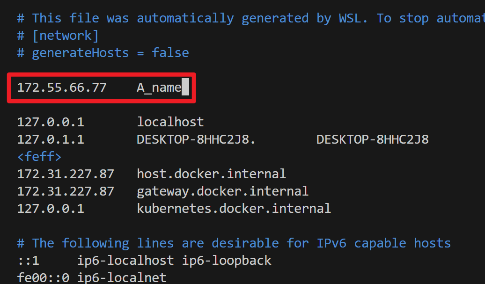

## 跨设备网络通讯

由于机器人算力或者系统版本原因，真机实验的时候通常需要跨设备进行数据交流，比如机器人设备获取图像，发送给服务器端进行识别检测。

数据通讯这块已经有很多解决方法，比如socket通讯，或者用flask这种网络服务器架构来接收数据，如果是ROS也有自己的方案。

[普通通讯](#跨设备传递普通的数据) | [ROS通讯](#ros之间通讯) | [优化延迟](#优化延迟)

### 跨设备传递普通的数据

这里提供一种简单的socket通讯方式，可以在不同系统的 python2 与 python3 之间发送数组数据，具体实现代码在 [`server.py`](./code/server.py)。

这是因为实验室的机器人是ubuntu14的，使用着古老的python2，而服务器那边又是python3的，所以实现了一版。使用方式如下：

* 服务器端
```python
# coding=utf-8 
from server import SocketServer
import numpy as np

if __name__ == "__main__":
    server = SocketServer('0.0.0.0', 15000)
    data = server.recv_data()
    print(data)
    server.send_data( [np.array([1,2,3]), 'Apple', (-1,2), []] )
    server.close()
```
* 客户端
```python
# coding=utf-8 
from server import SocketClient
import numpy as np

if __name__ == "__main__":
    # 这里是服务器端的ip
    client = SocketClient('172.31.227.87', 15000)
    data = client.send_and_recv_data(  [np.eye(3), []] )
    print(data)
```

### ROS之间通讯

> 参考：https://blog.csdn.net/XiaoYiDeXiaoYi/article/details/129644036

有时我们需要多台电脑运行ROS，并在彼此进行通讯，比如实验室的机器人是ubuntu14，运行ROS Indigo，新买的KinectDK得在Ubuntu18上跑，不得已要两台电脑，一台控制机器人，一台获取相机数据。

这时候你可以考虑用朴素的通讯方式在两者之间接收数据，比如上面的socket方法，但不方便与ROS整体的流程集成，比如我想用现成的手眼标定代码，他们提供了ROS运行的方式，那我们得让多台电脑的数据通讯也是基于ROS，这样才能无缝使用现有的工具。

设置的方式非常简单，比如机器人电脑称为A，相机电脑称为B，我们希望B的ROS相机节点可以直接发送图像数据给机器人的ROS节点。那么首先确保A和B在同个局域网内，或者彼此可以ping得通。

获取A的ip地址，假设是 172.55.66.77，将其加入B的host文件中，给它设置个名字，比如`A_name`：

    sudo vim /etc/hosts



保存退出，然后重启网络：

    sudo /etc/init.d/networking restart


接着，在B的终端内加入下面这两句，指定ROS的主节点的网络地址，也可以直接写入`.bashrc`文件：

    export ROS_HOSTNAME=A_name
    export ROS_MASTER_URI=http://A_name：11311

这样一来，你在B电脑这个终端跑的ROS程序，会直接和A的ROS进行通讯，相当于在ROS层面，电脑B成为了A的一部分。

这种方法好处是可以跨系统/软件版本的程序，但要注意通讯带来的延迟。特别是相机这种发送图像的，会比本地通讯慢很多。

### 优化延迟

毕竟是跨电脑，在发送图像这类较大的数据时不可避免会慢，这里分享一些应急技巧，主要是图像上的：

1. 如果是彩色图像信息，记得转成 uint 发送，数据量比起整数或者浮点数小很多。

2. 如果是深度图信息，虽然单通道，但浮点数还是很大，如果你对精度要求不是很高，可以考虑将其缩放到0~255范围，转成无符号整型的数组发送，在处理之前再缩放到原本的范围。这样可以减少数据量，提升传递速度，但精度下降。