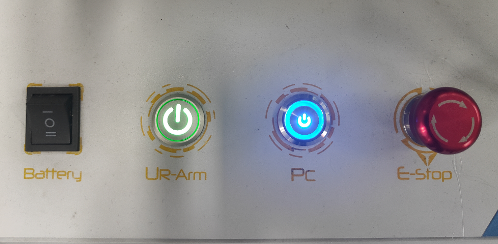
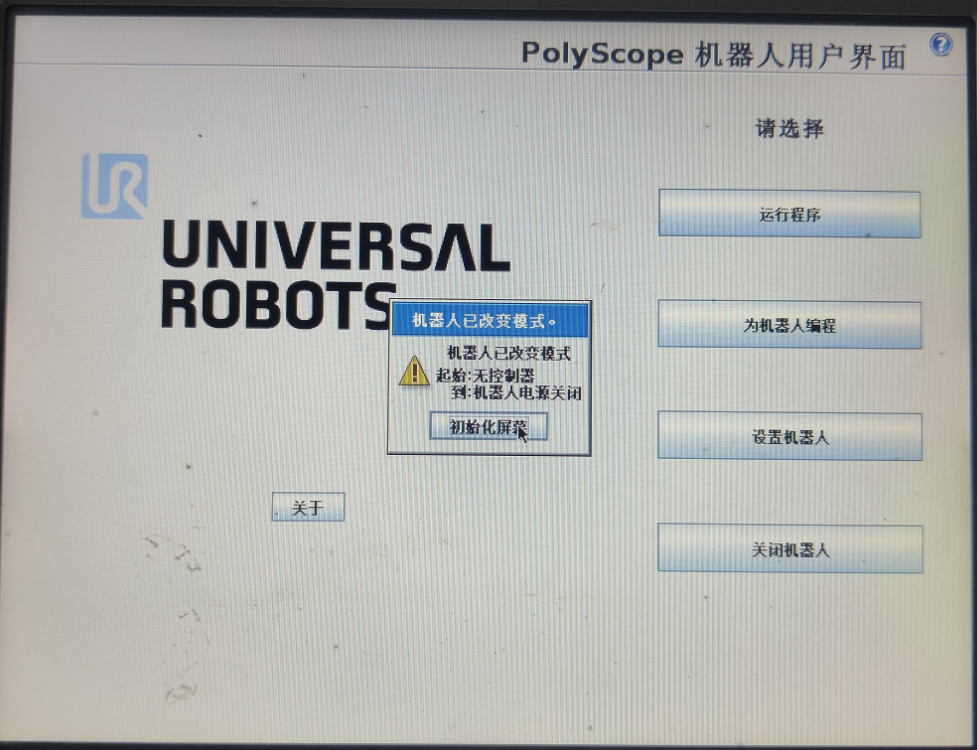
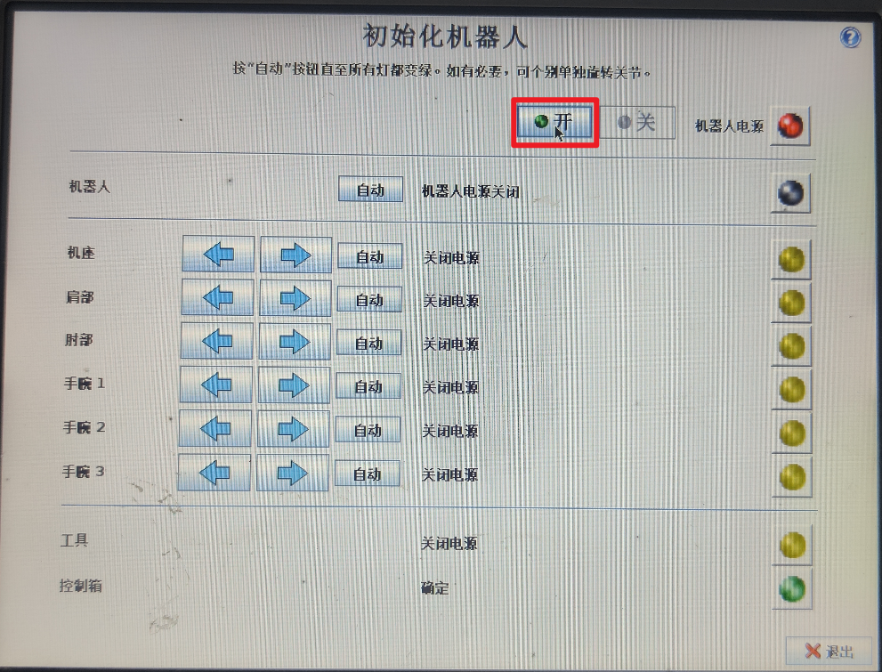
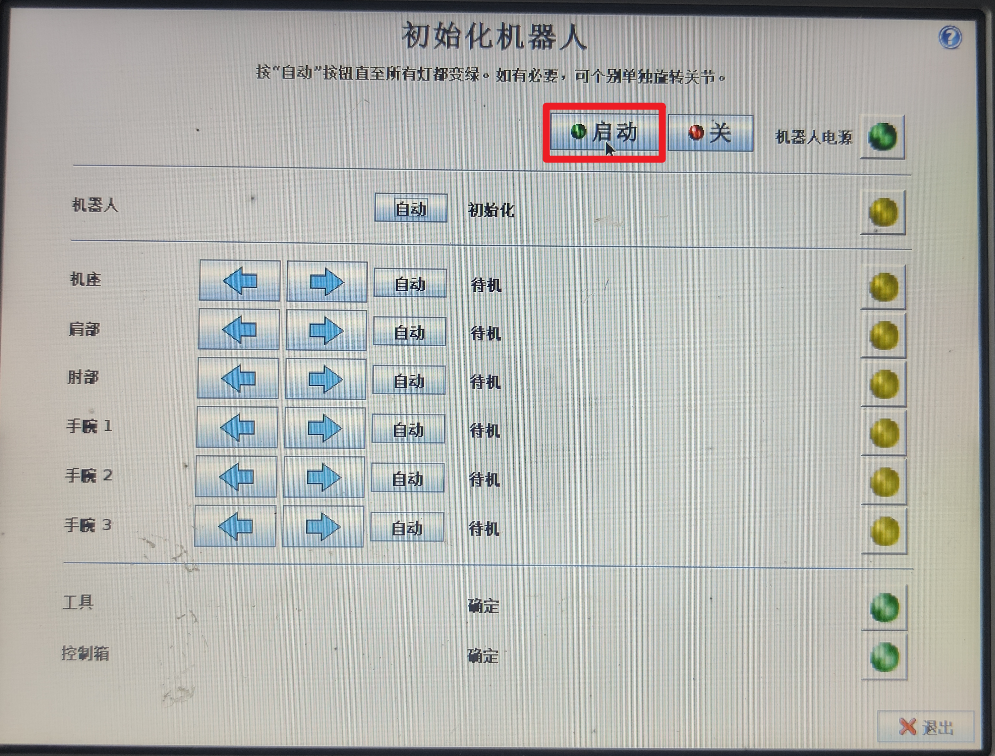
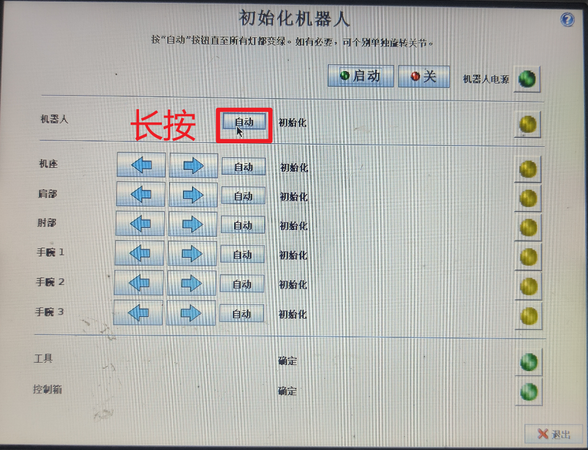
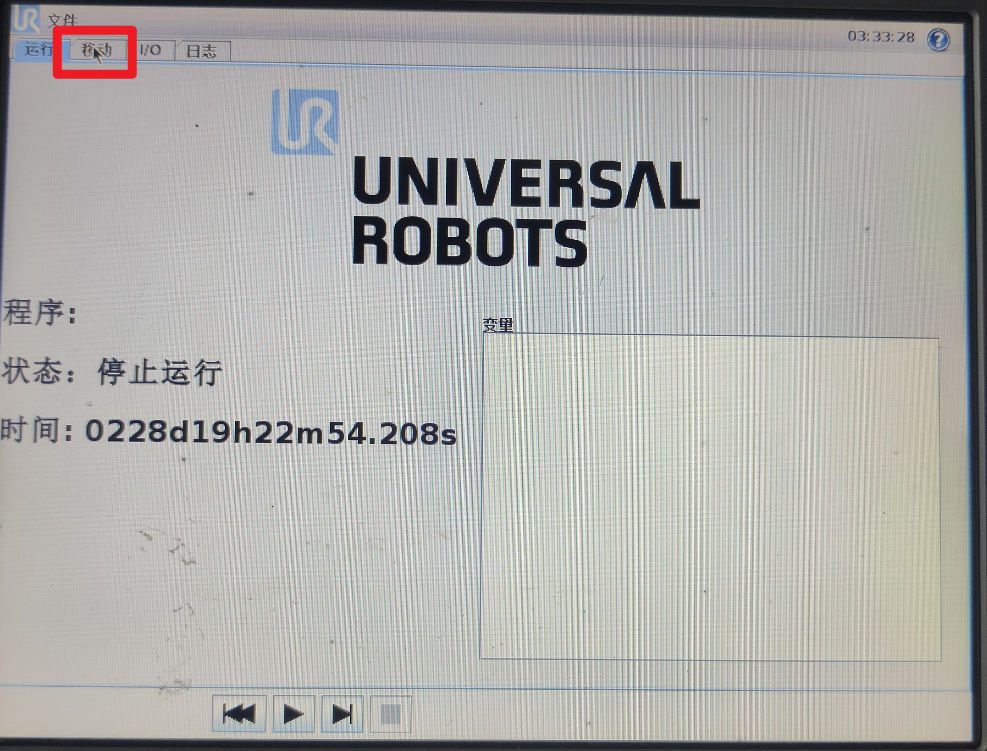
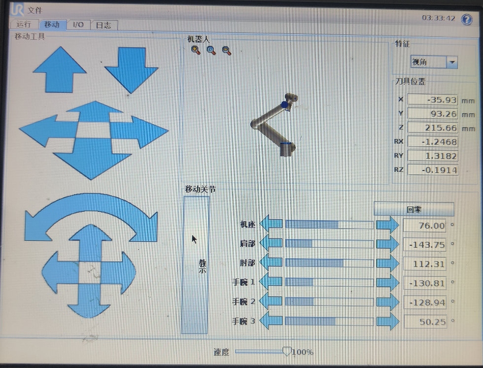
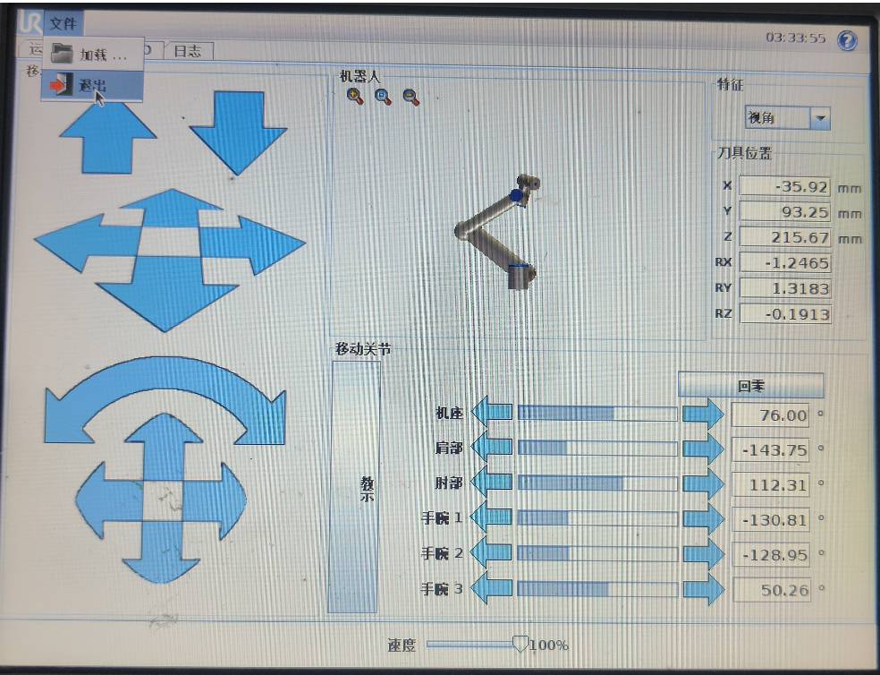

## 如何开启MOMA机器人

[返回机器人页面](../README.md)

### 电源开启
1. 首先确保机器人的电池已经通电。电压36V左右。

2. 然后MOMA底座的另一侧是机器人开关，从左到右分别是总开关，机器臂开关，电脑主机开关，急停按钮。机器臂和电脑主机是可以独立开启的。机器臂和电脑都关闭后才能将左侧的总开关关闭。

### 机器臂初始化

1. 机器人基本都会配备一个示教器，我们可以在这里进行很多控制操作，原本这个是有触屏的，但坏了，所以配了个鼠标点击。当我们启动机器臂后，需要初始化机器臂。首先点击初始化屏幕。

2. 在初始化界面中，我们先启动电源。注意屏幕中，右上角“机器人电源”字样的红灯图标会变成绿色，说明电源开启成功。

然后点击启动，机器臂这时候会嘎吱的动几下。

3. 然后长按第二行的自动按钮，机器臂会自动转动一些关节，直到我们界面中所有的黄灯图标都变成绿色，这时候就表明初始化完成。完成后就可以点击界面右下角的按钮退出初始化界面。

### 机器臂控制

1. 在主界面中，点击“运行程序”，进入控制界面。然后选择上方菜单栏的“移动”。

2. 在移动界面中，我们可以控制机器臂各种方式的运动。其中比较重要的是正中间竖长的按钮“教示”，我们如果长按着它，就可以手动去拖拽机器臂，摆成自己想要的姿态。

3. 如果你想返回初始界面，点击最上方的“文件”，选择“退出”。

