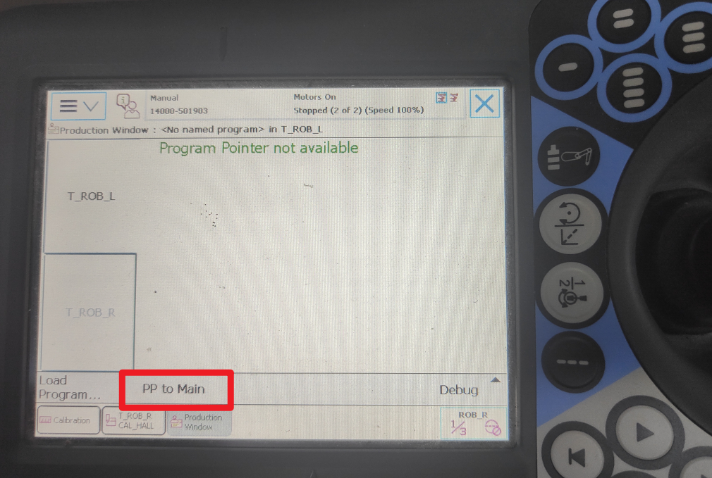
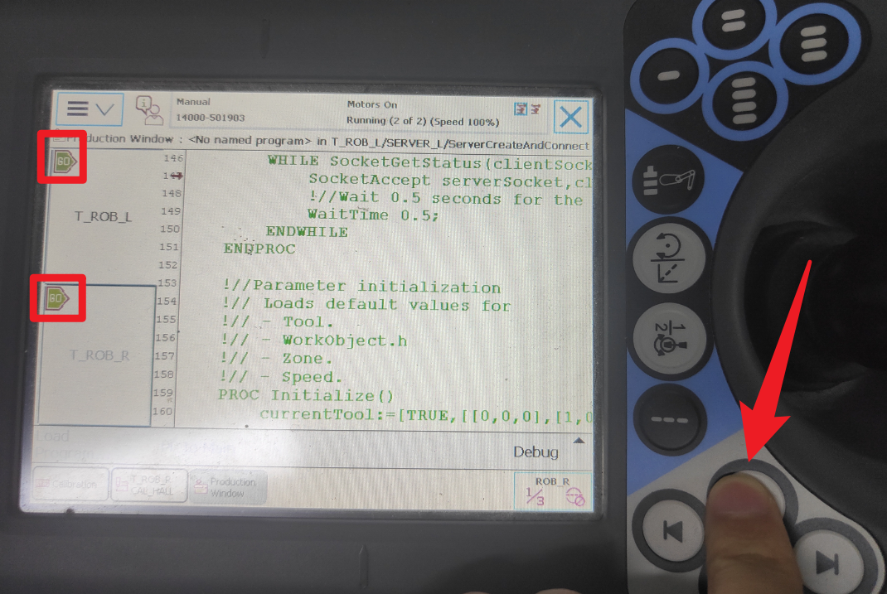

## ABB YuMi

一款双臂的协作机器人

### [机器人设置与启动](./doc/hard.md)

### 硬件端程序执行

目前机器人已经配置好环境，将需要跑python代码与机器人通讯的电脑与机器人的无线相连，安装 yumipy 库，下面章节会介绍，后面可能会加个使用说明。

在示教器这里，需要执行一些通讯程序才能与外接的笔记本联系，我们从右上角的菜单点击，进入“Production Window”，默认已经有代码了，我们只需要点击下方的“PP to Main”，就可以加载代码。

然后点击一下右边实体按钮的执行按键，代码会开始执行，而且你也可以看到屏幕界面中出现了两个绿色的“GO”图标，表明程序执行中。这之后就可以在笔记本上使用yumipy来控制机器臂。

### 代码程序设置

https://github.com/galou/yumipy/tree/robotware6_06