## YuMi 机器人硬件设置

[返回机器人主页](../README.md)

### 机器人开启
1. 首先确保机器人的电源线已经查到插座。

2. 电源总开关在机器人底座，顺时针向上旋转为开启，逆时针向左旋转为关闭

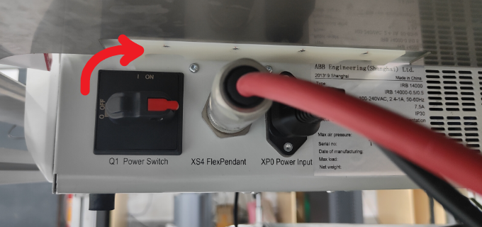

### 界面简介

1. 机器人基本都会配备一个示教器，大多数操作也是在这上面进行，示教器分为左侧屏幕软件区，以及右侧实体按键区，示教器上方有个红色大按钮，这个是急停按钮，直接按下去机器人就会紧急停止。

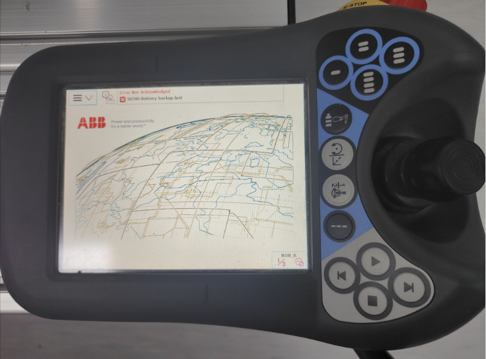

2. 屏幕区域的左上角有个菜单按钮，点击后打开菜单。

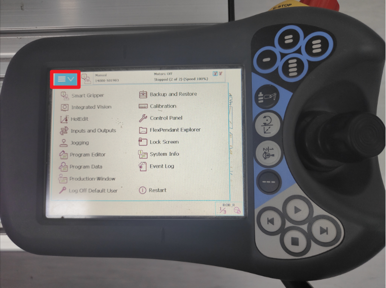

3. 这里我们会经常用到的是校准（Calibration）和生产窗口（Production Window）。控制机器臂之前要确保它的关节信息正确，所以一般启动机器人之后要先用校准功能进行初始化，之后才能进行手动控制或者程序执行。

### 双臂校准 Calibration

1. 首先先将机器人切换成手动操作模式。点击屏幕界面的右下角，会跳出一列小菜单，小菜单的第一个图标就是机器人的操作模式，点击后会跳出一个小窗口，让你选择模式，我们先点击这里面手的图标，切换成手动模式。

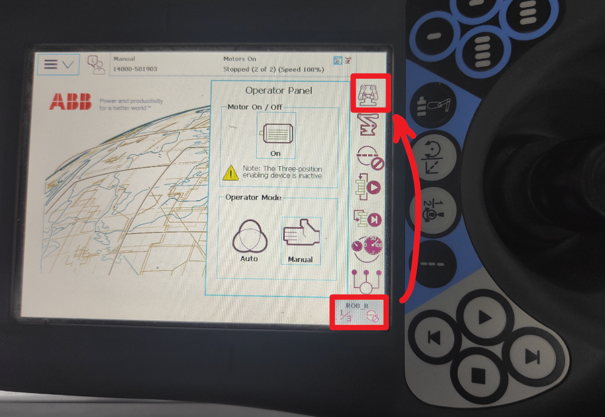

另外侧边小菜单的第二个机器臂图标可以选择控制的机器臂，比如当前控制的是右手。

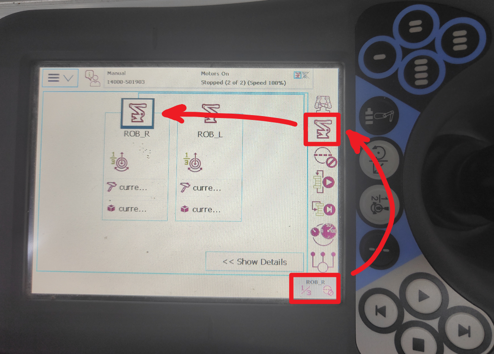

2. 机器人的校准程序会对机器臂关节进行小幅度的转动来确定关节实际的角度，它要求初始的关节角度和它出场时预设的姿态接近，这样程序才能校准成功，所以在执行程序前，我们需要先将手臂调整成默认的姿态（下图是默认姿态）。每个关节出都用物理的凹凸槽指示了大概对齐的位置。（值得注意的一点是，其实yumi的两个手臂都是一样的款式，并非镜面对称的，它们默认姿态下手部的ABB图标朝向应该相同）

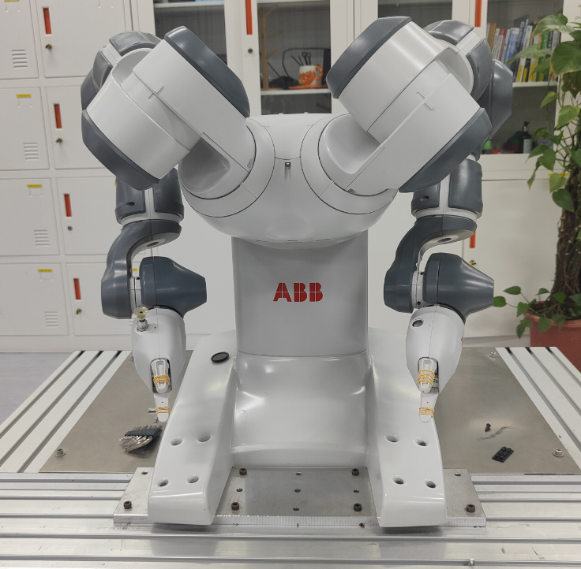

3. 为了手动调整姿态，我们先通过左上角的菜单，进入“Jogging”面板。这里可以看到机器臂的状态。

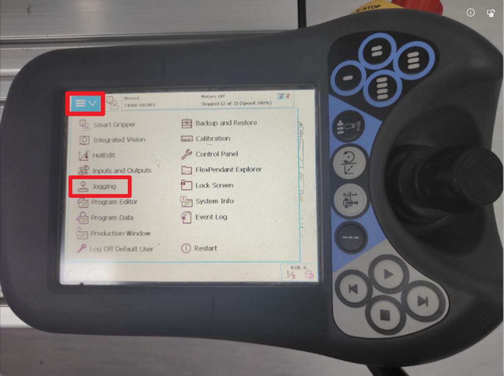

4. 我们点击下方一栏中的“Enable Lead-through”，这样会进入可拖动模式，可以手动拖拽转动机器臂的各个关节，我们将机器人的状态摆成接近初始状态。

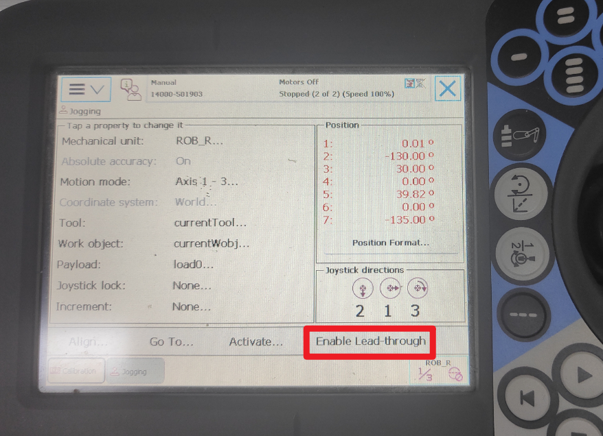
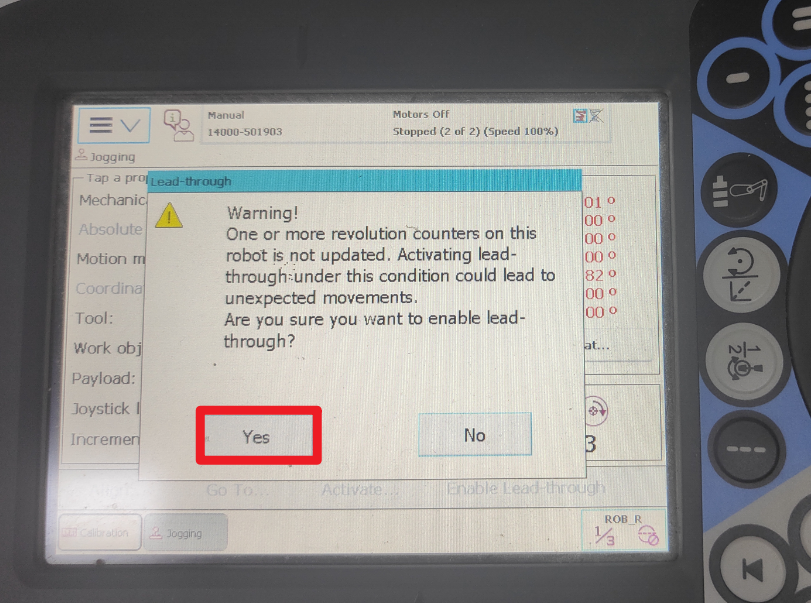

姿态大概正确后，点击“Disable Lead-through”让机器臂保证当前状态。

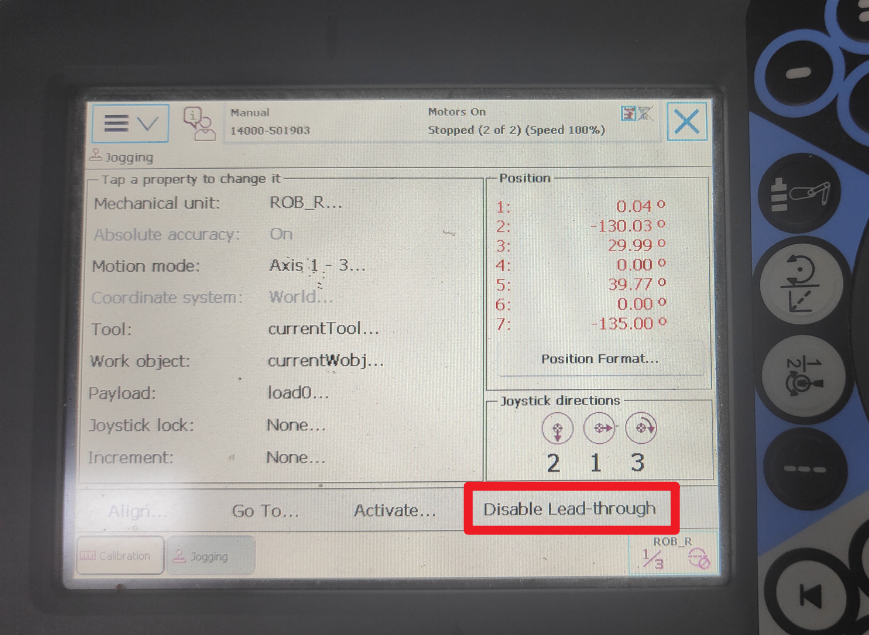

4. 回到机器人的主菜单（屏幕左上角的菜单按钮点击出现的菜单），选择Calibration，进入校准界面。可以看见界面中有两行机器臂信息，一个是右臂，一个是左臂，它们需要分别进行校准，下面以右臂为例进行校准。首先点击右臂（ROB_R）这一行。

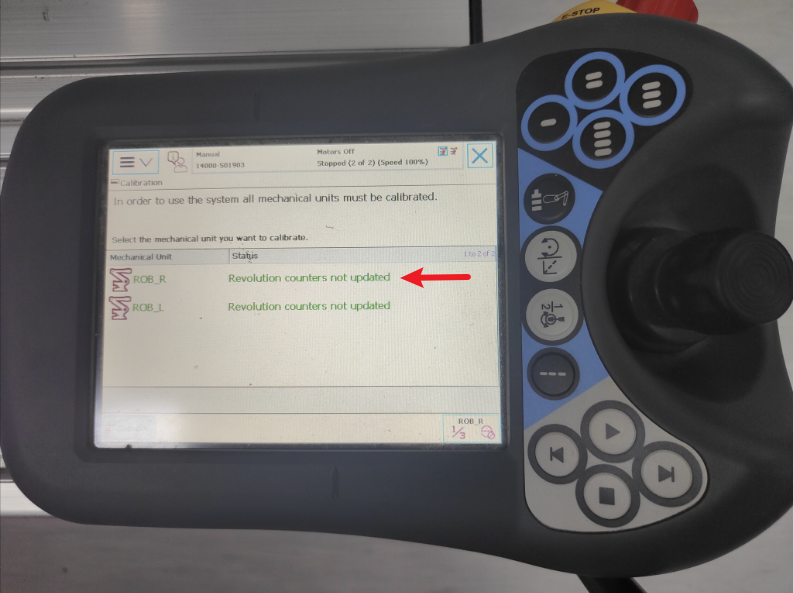

5. 随后进入新的界面，展示了机器臂的关节信息，我们点击下面的“Call Calibration Method”调用程序。 

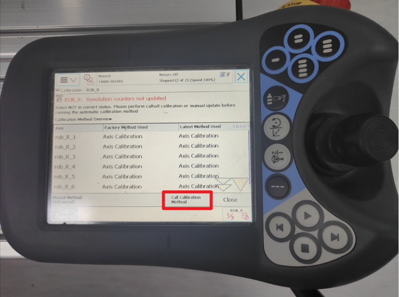

6. 这时候会进入程序界面，我们按下右臂实体按键区域的三角形，这个按钮是执行程序的按钮，顺带一提，下面正方形的按钮是暂停程序的按钮。

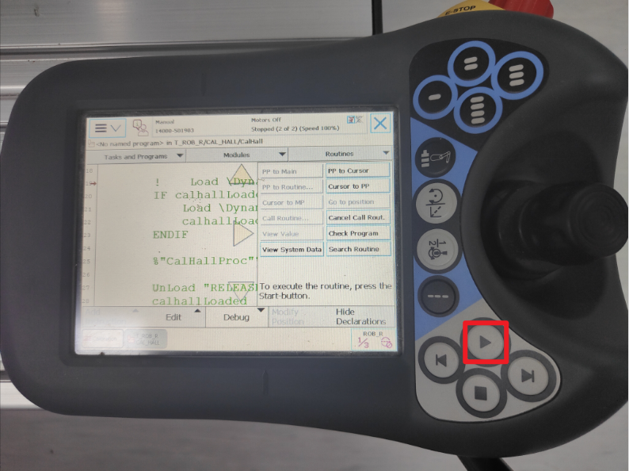
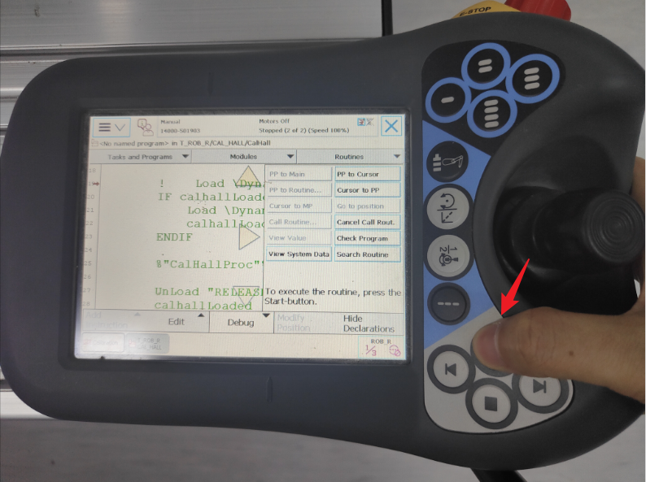

7. 程序开始执行，又是一个选择界面，我们点击“1”的选项

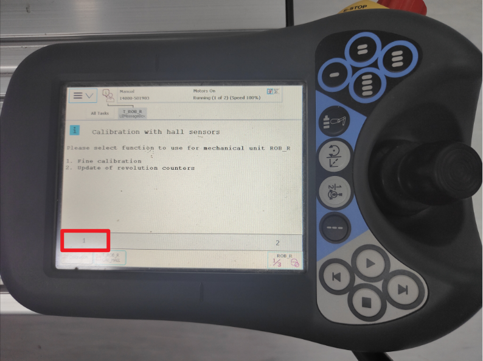

8. 又一个选择界面，我们点击“Yes, do a fine calibration”的选项

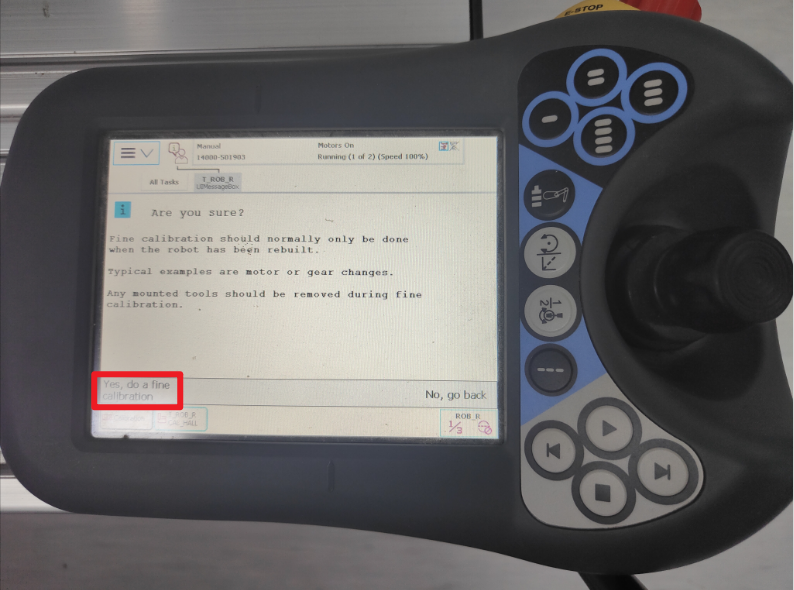

9. 然后程序会显示一些打着x的列表，这表示的是是否对某个关节进行校准（x表示勾选上了）。界面下方有一列选项，有1、2、3、4，这些是用于取消或者选择哪个关节进行校准，我们默认全部都要，所以点击“Next”就行。

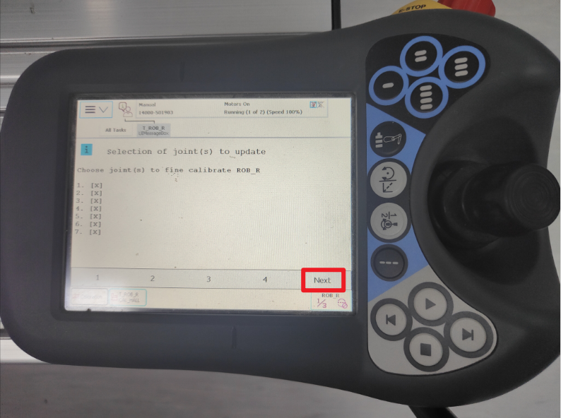
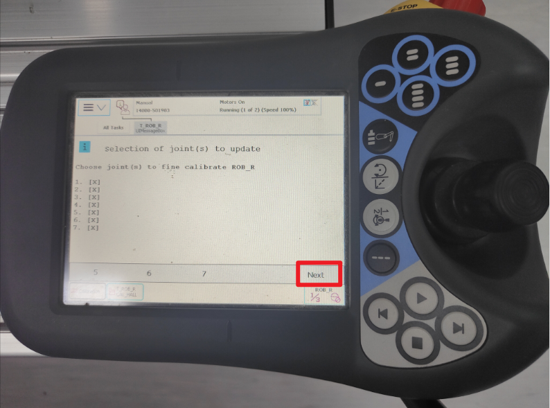

10. 然后点击“OK”，这时候机器臂会开始自己轻微地动起来，逐个关节进行运动校准，可能要等上几分钟，期间可以看到屏幕界面上方的信息栏里面，写着“Running”，说明程序还在执行中。

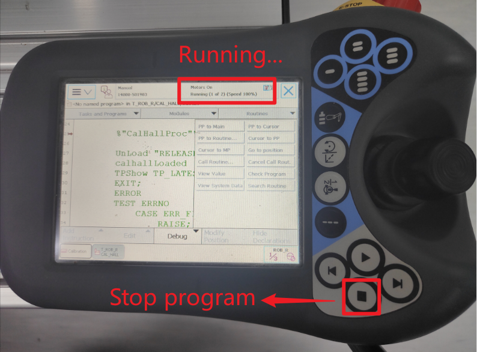

11. 等右臂完成校准后，同样对左臂进行一样的操作，就完成了机器人的初始化。

### 手动遥控

不执行程序的时候，我们可以用右侧实体按钮区域进行机器臂控制，主要有3个按钮（下图中红色圈圈的地方），从上往下的功能分别是“切换左右手”、“切换关节调整还是末端姿态”、“切换控制的关节对象”，在“Jogging”界面中，可以看到当前遥感动起来的时候对应的关节或者坐标。然后转动或者推动最右侧的这把黑色遥感，机器臂会对应的运动。

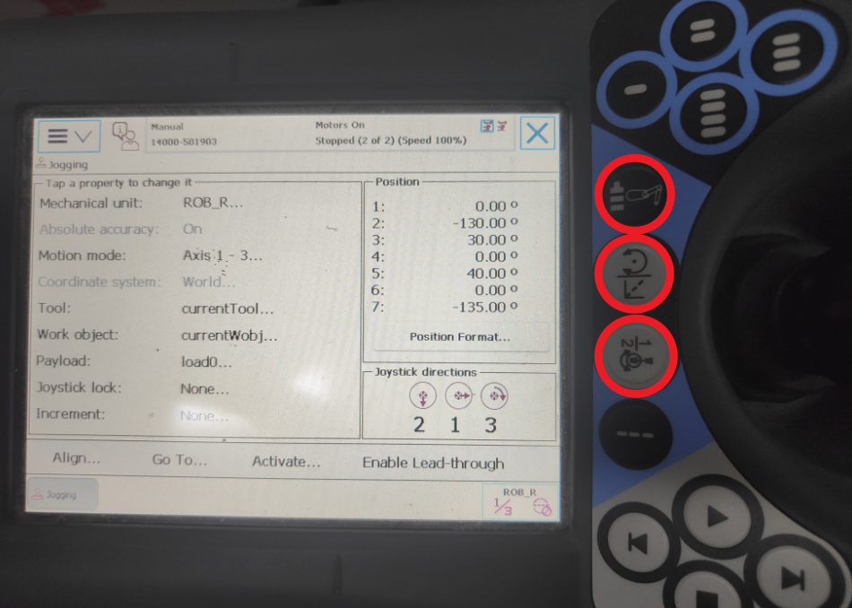
